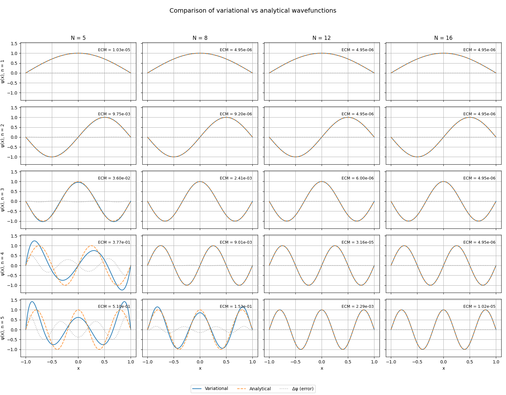

# Deep Well Quantum Solver

This Python project computes the energy levels of a quantum particle in an infinitely deep potential well using a variational method and solves the generalized eigenvalue problem.

---

## Features

- Constructs overlap and Hamiltonian matrices using a polynomial basis.
- Solves the generalized eigenvalue problem using `scipy.linalg.eigh`.
- Compares numerical eigenvalues with the exact analytical solution.
- Prints a formatted comparison table for different basis sizes `N`.

---

## Project Structure

```plain
Deep Well/
├── main.py       # Main script (entry point)
└── deepwell/
├── __init__.py
├── config.py     # Configuration: basis sizes N = \[5, 8, 12, 16]
├── solver.py     # Core functions: matrix builders, solver, printer
```

---

## How to Run

From the root directory:

```bash
python main.py
```

Or, using module syntax:

```bash
python -m deepwell.main
```

---

## Output Examples

### Table 3.1. Energy levels of the infinitely deep potential well

| n | N = 5   | N = 8   | N = 12  | N = 16  | Exact   |
| - | ------- | ------- | ------- | ------- | ------- |
| 1 | 2.4674  | 2.4674  | 2.4674  | 2.4674  | 2.4674  |
| 2 | 9.8754  | 9.8696  | 9.8696  | 9.8696  | 9.8696  |
| 3 | 22.2934 | 22.2074 | 22.2066 | 22.2066 | 22.2066 |
| 4 | 50.1246 | 39.4892 | 39.4784 | 39.4784 | 39.4784 |
| 5 | 87.7392 | 63.6045 | 61.6862 | 61.6850 | 61.6850 |

> As expected, the approximation improves with increasing basis size $N$, converging toward the exact analytical values.

### Comparison of variational vs analytical wavefunctions
