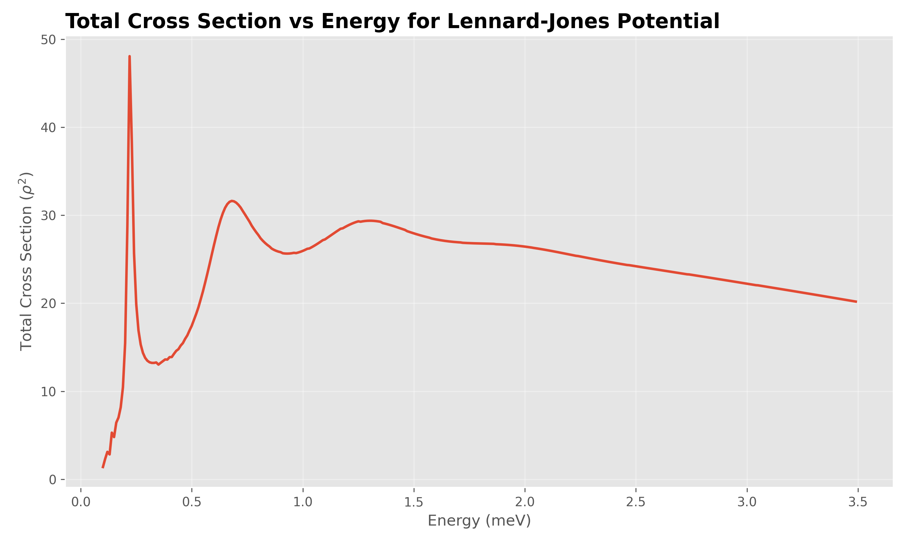
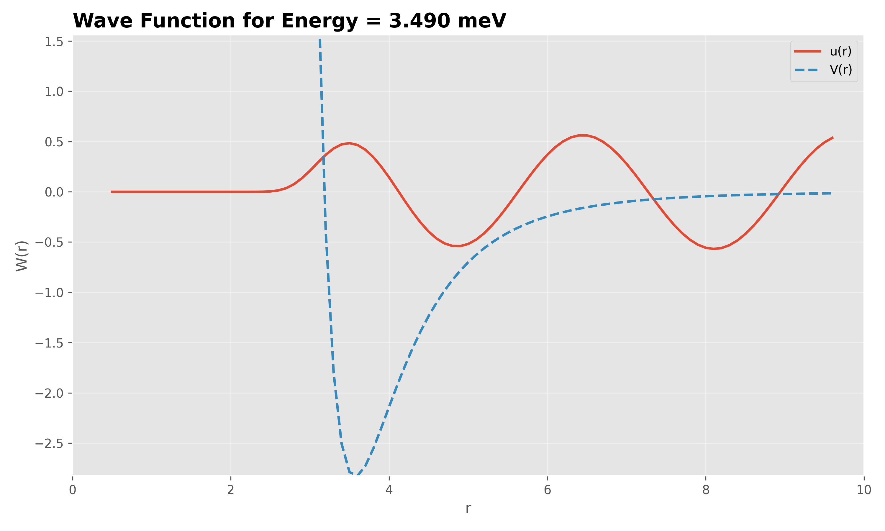

# Cross Section Module

This project computes quantum scattering cross sections for a spherically symmetric Lennard-Jones potential using Numerov integration and phase shift analysis.

## 🔧 Modules Overview

### 1. `config.py`

**Purpose:** Stores all global physical constants and output paths.

Includes:

- Grid boundaries (`rmin`, `rmax`), step size (`dr`)
- Potential parameters (`rho`, `eps`)
- Output image directory and configuration

---

### 2. `potential.py`

**Purpose:** Implements the Lennard-Jones potential and effective radial potential.

Functions:

- `lennard_jones_potential(r)`: classic 12-6 LJ potential
- `effective_potential(r, l, E)`: includes centrifugal term and total energy

---

### 3. `bessel_functions.py`

**Purpose:** Computes spherical Bessel functions (regular and irregular) via upward recursion.

Functions:

- `regular_bessel_upwards(l, x)`
- `irregular_bessel_upwards(l, x)`

Used for asymptotic matching and phase shift calculation.

---

### 4. `numerov.py`

**Purpose:** Implements the Numerov method to solve the radial Schrödinger equation.

Functions:

- `build_grid(...)`: constructs radial grid
- `initialize_conditions(...)`: sets small-r boundary conditions
- `numerov_integrate(...)`: returns normalized wavefunction and boundary values

---

### 5. `phase_shift.py`

**Purpose:** Computes the quantum phase shift \( \delta_l \) by matching numerical and analytical asymptotic solutions.

Function:

- `compute_phase_shift(...)`: computes \( \delta_l \) using Bessel functions and wavefunction tail

---

### 6. `cross_section.py`

**Purpose:** Computes the total scattering cross section by summing partial wave contributions.

Function:

- `compute_total_cross_section(...)`: returns \( \sigma(E) \) over a range of energies

---

### 7. `visualization.py`

**Purpose:** Plots:

- Cross section vs energy
- Wavefunction with potential overlay

Automatically saves plots to PNG files.

---

### 8. `main.py`

**Purpose:** Executes the full pipeline:

- Computes total cross section
- Plots results
- Computes and plots wavefunction at maximum energy

---

## 🚀 Usage

```bash
python3 -m cross_section_pipeline.main
```

## Output Examples



